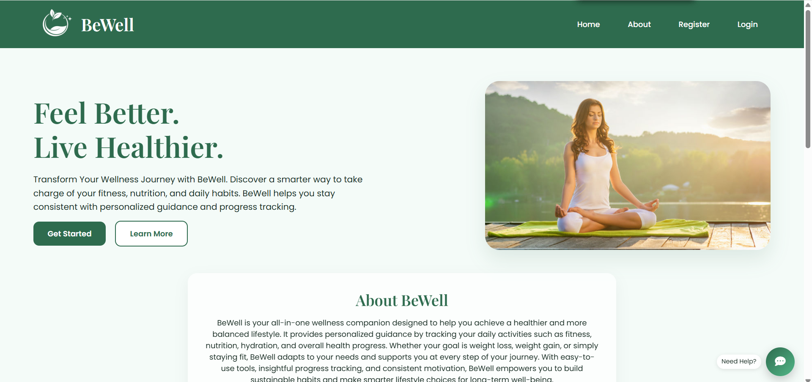
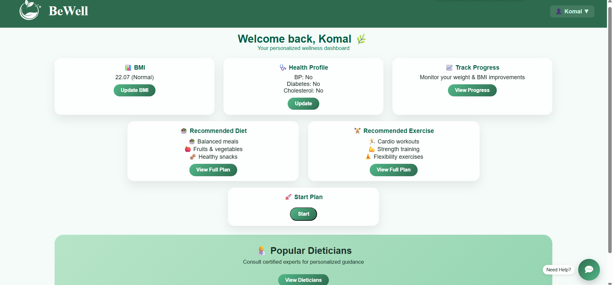
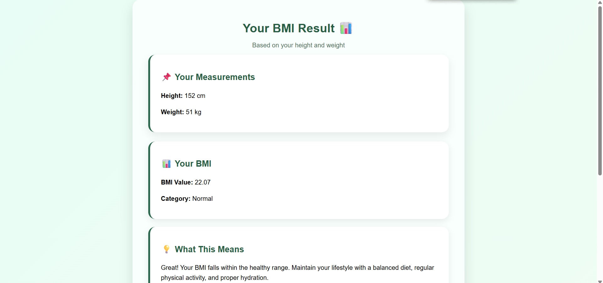
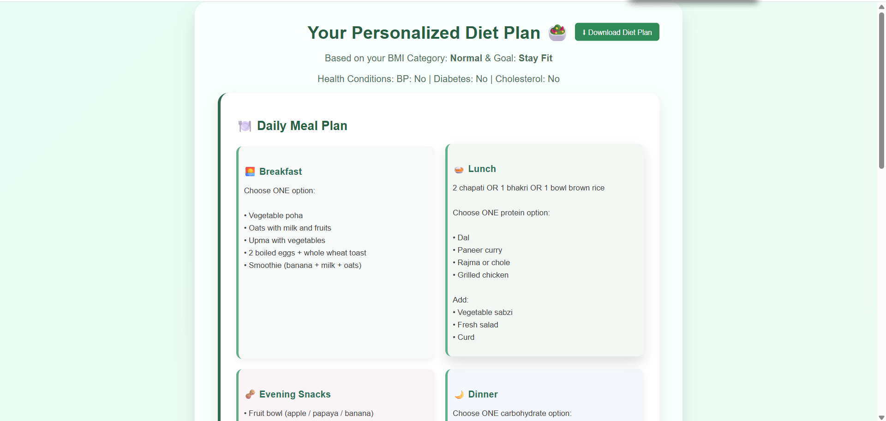
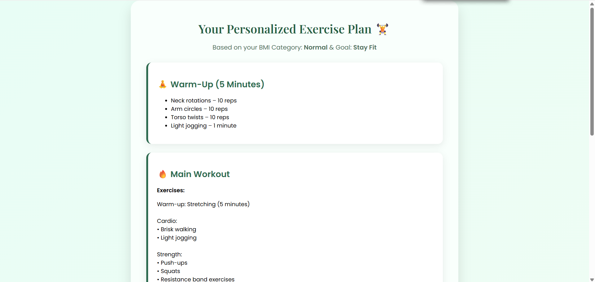
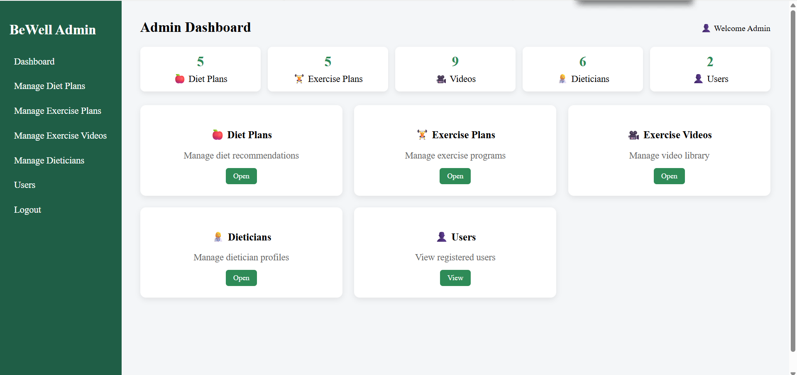

# 🌿 BeWell — Health Fitness & Wellness Recommendation System

A full-stack web application that delivers personalized fitness and diet 
recommendations based on user BMI, health goals, and medical conditions.



---

## ✨ Features

- 📊 **BMI Calculator** — computes BMI and categorizes health status automatically
- 🥗 **Personalized Diet Plans** — custom meal plans based on BMI, goal, and health conditions
- 🏋️ **Personalized Exercise Plans** — tailored workout routines with warm-up and cooldown
- 📈 **Progress Tracking** — daily steps, water intake, weight tracking with visual charts
- 🔒 **Secure Authentication** — email-verified registration with role-based access control
- 👨‍⚕️ **Dietician Directory** — browse certified nutrition experts with contact details
- 🛠️ **Admin Dashboard** — full CRUD control over diet plans, exercise plans, videos, and users

---

## 🖥️ Screenshots

### User Dashboard


### BMI Result & Analysis


### Personalized Diet Plan


### Personalized Exercise Plan


### Admin Dashboard


---

## 🛠️ Technologies Used

| Layer | Technology |
|---|---|
| Backend | PHP |
| Frontend | HTML, CSS, JavaScript |
| Database | MySQL |
| Local Server | XAMPP (Apache + MySQL) |

---

## ⚙️ How to Run Locally

### Prerequisites
- XAMPP installed on your system

### Steps

```bash
# 1. Clone the repository
git clone https://github.com/Shreya-1101/Health-Fitness-and-Wellness-Recommendation-System-Project.git

# 2. Move the project folder to XAMPP's htdocs directory
# Example path: C:/xampp/htdocs/fitness_website

# 3. Start Apache and MySQL from XAMPP Control Panel

# 4. Import the database
# Open phpMyAdmin → Create a new database → Import the .sql file from the /db folder

# 5. Open in browser
http://localhost/fitness_website
```

---

## 🔐 Security

- Email verification required at registration
- Role-based access control (RBAC) separating user and admin privileges
- Sensitive health data protected with session-based authentication

---

## 👩‍💻 Author

**Shreya Tatar**  
[LinkedIn](https://linkedin.com/in/shreya-tatar) · 
